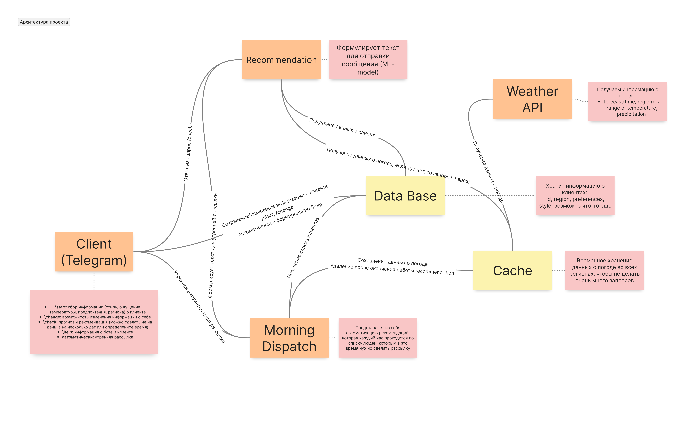

# Документация по проекту "Гардеробный"

### Структура проекта

Client (Telegram) $-$ то, что пользователь видит первее всего. После команды /start ему предложится опросник с городом проживания, желаемым стилем одежды (будут предложены несколько вариантов картинок), флажком делать ли автоматизацию запроса (Morning Dispatch), а также персональными предпочтениями вроде "мне всегда жарко" или "мне всегда холодно". Данные в любой момент можно изменить командой /change

Database $-$ данные, полученные в опроснике, отправляются в эту базу данных, где хранятся до момента их применения в Recommendation и Morning Dispatch

Cache $-$ база данных, где хранятся прогнозы погоды в городах, которые пользователи указали в опроснике. Они обновляются через Weather API каждый день в полночь по Гринвичу

Weather API $-$ программа, отвечающая за связь приложения с опенсорсным источниками прогноза погоды

Recommendation $-$ модель на базе машинного обучения, отвечающая непосредственно за подбор одежды на день. Создана на данных из открытых источников. Вызывается командой /check

Morning Dispatch $-$ автоматизация рекомендаций. Каждые 60 минут она проверяет время пользователей и флажок. Если условия совпали, то отправляет запрос в Recommendation и выдаёт пользователям рассылку с рекомендациями на ближайший день

### Сроки

Client $-$ три недели

Weather API $-$ неделя

Database $-$ неделя

Cache $-$ неделя

Recommendation $-$ три недели

Morning Dispatch $-$ две недели

### Состав команды и зоны их ответственности:

Александр Благий $-$ тимлид, ответственен за клиентскую часть (ручки и тп) и за Weather API

Анастасия Кузьмина $-$ ответственна за ML-составляющую (Recommendation)

Кобельков Ярослав $-$ ответственен за базы данных (Data Base и Cache) и за Morning Dispatch
